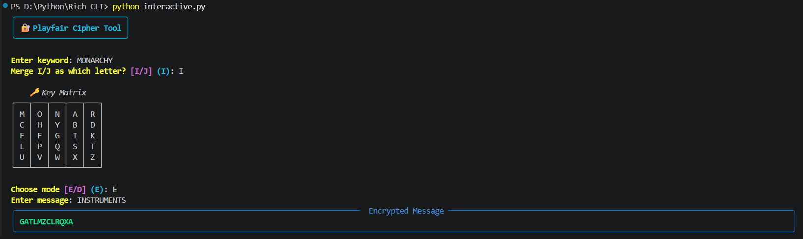
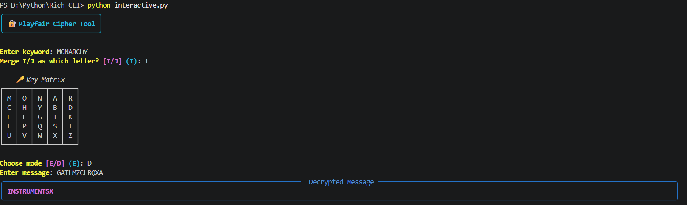

# 🔐 Playfair Cipher Implementation (Python)

A complete and educational **Python implementation of the Playfair Cipher encryption algorithm**.
This project demonstrates **matrix generation, digraph processing, and classical substitution encryption & decryption** using structured logic.

It is created as a **learning and academic project** to understand how classical digraph-based cryptography works internally, not as a production-ready security system.

---

## 🧱 Project Structure

```bash
playfair-cipher-python/
│
├── assets/           # Screenshots
├── app.py            # Basic CLI Version
├── interactive.py    # Rich-powered CLI
├── requirements.txt  # Dependencies
├── LICENSE           # Project license
└── README.md         # Project documentation
```

---

## ✨ Features

### 🔑 Key Matrix Generation
- Generates a 5×5 Playfair matrix using a keyword
- Merges `J` into `I` (standard academic convention)
- Fills remaining alphabet in correct order
- Automatically removes duplicate letters

### 🔒 Encryption
- Applies Playfair rules:
  - Same row → shift right
  - Same column → shift down
  - Rectangle rule → swap columns
- Produces correctly formatted ciphertext

### 🔓 Decryption
- Reverses Playfair encryption logic:
  - Same row → shift right
  - Same column → shift down
  - Rectangle rule → swap columns
- Outputs decrypted plaintext (including padding if present)

### 🧮 Educational Focus
- Clean and readable logic
- Modular and structured functions
- Ideal for beginners in cryptography
- No external dependencies

### 🎨 Rich CLI (Interactive Mode)
- Beautiful colored terminal UI using Rich
- Displays key matrix in a structured table
- Interactive prompts with validation
- Clean and readable output panels

### ⚡ Dual Mode Support
- 🧼 Basic CLI → Lightweight, no dependencies
- 🎨 Rich CLI → Enhanced UI with colors and panels

---

## 🛠 Technologies Used

| Technology        | Role                         |
| ----------------- | ---------------------------- |
| **Python 3**      | Core programming language    |
| **String Module** | Alphabet handling            |
| **Matrix Logic**  | 5×5 key table implementation |
| **Rich**          | Styled CLI, colors, panels   |

---

## 📌 Purpose of This Project

This project is built to:
- Understand classical Playfair cryptography
- Learn digraph substitution techniques
- Explore historical encryption algorithms
- Study matrix-based encryption systems

> ⚠️ This project is intended strictly for learning and demonstration purposes.

---

## ▶️ How to Run

### 1️⃣ Clone the repository
```bash
git clone https://github.com/ShakalBhau0001/playfair-cipher-python.git
```

### 2️⃣ Navigate to the project folder
```bash
cd playfair-cipher-python
```

### 3️⃣ Install Dependencies

```bash
pip install rich
```

**OR**

```bash
pip install -r requirements.txt
```

---

### 4️⃣ Running the Project

#### 🧼 Basic CLI Version

```bash
python app.py
```

#### 🎨 Rich Interactive Version

```bash
python interactive.py
```

### 5️⃣ Follow the prompts for Basic CLI Version
- Enter a keyword
- Choose direction:
  - `E` → Encrypt
  - `D` → Decrypt
- Enter your message
- View the result

---

## 🔎 Example

> Encryption :

```bash
Enter keyword: MONARCHY

Encrypt or Decrypt (E/D): E
Enter message: INSTRUMENTS

Encrypted: GATLMZCLRQXA
```

> Decryption :

```bash
Enter keyword: MONARCHY

Encrypt or Decrypt (E/D): D
Enter message: GATLMZCLRQXA

Decrypted: INSTRUMENTSX
```

> _**(Note: Final padding letter may appear during decryption.)**_

---

## ⚠️ Limitations

- Not secure for real-world use
- Classical cipher (easily breakable)
- Does not automatically remove padding after decryption
- CLI-based interaction only

---

## 🌟 Future Improvements

- Add automatic padding removal
- Add configurable I/J handling
- Add input validation for shift values
- Add file encryption support
- Create GUI version
- Combine into a classical cryptography toolkit

---

## ⚠️ Disclaimer

This implementation is created **for educational and learning purposes only.**
The Playfair Cipher is historically significant but cryptographically insecure and must not be used to protect real-world sensitive data.

---

## 📸 Preview

### 1. **Encryption**



### 2. **Decryption**



---

## 🪪 Author

> **Shakal Bhau**

> **GitHub: [ShakalBhau0001](https://github.com/ShakalBhau0001)**

---

## ⭐ Support

If you like this project, consider giving it a ⭐ on GitHub!

---
